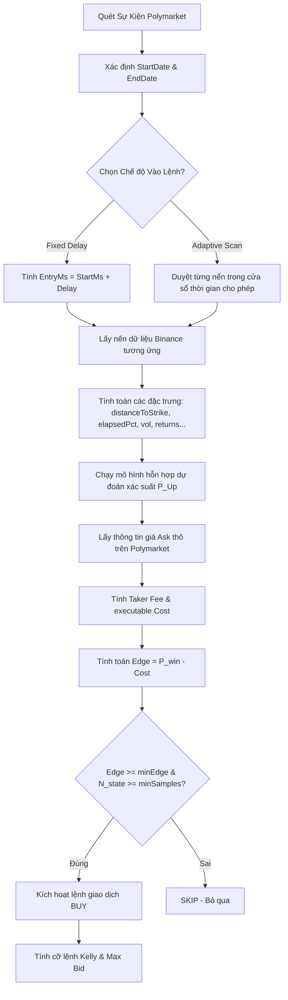

# Hướng dẫn chi tiết: Cách hoạt động của Tab Polymarket trong Regime Routing (Short-term)

Tài liệu này giải thích chi tiết từng bước một, từ nguồn dữ liệu đầu vào, cách xử lý nến, các công thức toán học/xác suất, cho đến quy trình đưa ra quyết định giao dịch và quản lý vốn trong tab **Polymarket** thuộc **Phan tich 5 - Regime Routing (Short-term)**.

---

## 1. Tổng quan & Mục tiêu thiết kế

Tab Polymarket được thiết kế nhằm mục đích **đánh giá hiệu quả giao dịch các hợp đồng quyền chọn nhị phân BTC Up/Down trên Polymarket** bằng cách kết hợp thông tin trạng thái thị trường (Regime) từ mô hình Hidden Markov Model (HMM) với dữ liệu sổ lệnh (CLOB) và dữ liệu sự kiện (Gamma) thực tế của Polymarket.

Hợp đồng BTC Up/Down trên Polymarket hoạt động như sau:
*   **Trận chiến nhị phân (Binary Options):** Chỉ có hai kết quả:
    *   **UP (hoặc YES):** Giá BTC tại thời điểm kết thúc (EndDate) **lớn hơn hoặc bằng** giá BTC tại thời điểm bắt đầu (StartDate). Người nắm giữ token UP nhận được \$1.00, token DOWN nhận \$0.00.
    *   **DOWN (hoặc NO):** Giá BTC tại thời điểm kết thúc **nhỏ hơn** giá BTC tại thời điểm bắt đầu. Người nắm giữ token DOWN nhận được \$1.00, token UP nhận \$0.00.
*   **Giá giao dịch:** Mỗi token UP hoặc DOWN dao động từ \$0.00 đến \$1.00, đại diện trực tiếp cho xác suất ngầm định (Implied Probability) của thị trường. Ví dụ: Nếu giá token UP là \$0.62, thị trường đang kỳ vọng xác suất BTC tăng là 62%.

**Mục tiêu của hệ thống:** Tìm ra sự lệch pha (Edge) giữa **Xác suất dự báo của mô hình (Model Probability)** và **Xác suất ngầm định của thị trường sau khi trừ chi phí (Market Cost)**. Nếu Edge đủ lớn, hệ thống sẽ đề xuất lệnh mua tương ứng.

---

## 2. Nguồn dữ liệu & Các API sử dụng

Hệ thống kết nối trực tiếp với 3 nguồn dữ liệu:
1.  **Dữ liệu Regime HMM:** Được sinh ra từ mô hình HMM chạy trên bộ dữ liệu Binance BTCUSDT (futures hoặc spot). Mỗi nến thời gian (ví dụ: 5m, 1h) sẽ được gán một trạng thái (State) từ $0$ đến $K-1$, kèm theo mức độ tin cậy (Confidence).
2.  **Polymarket Gamma API (`https://gamma-api.polymarket.com`):** Dùng để tìm kiếm và quét thông tin cấu trúc các sự kiện giao dịch.
    *   Sử dụng endpoint `/public-search` với từ khóa `"Bitcoin Up or Down daily"` (cho khung 1 ngày - 1D) hoặc `"Bitcoin Up or Down 4 hour"` (cho khung 4 giờ - 4H).
    *   API này cung cấp các thông tin: ID sự kiện, ID token UP/DOWN (CLOB Token IDs), câu hỏi sự kiện, thời gian bắt đầu, thời gian kết thúc, trạng thái đóng/mở sự kiện và kết quả đã phân định (Resolved Outcome).
3.  **Polymarket CLOB API (`https://clob.polymarket.com`):** Sổ lệnh tập trung của Polymarket.
    *   Endpoint `/prices-history`: Lấy lịch sử giá giao dịch của token UP/DOWN trong quá khứ để chạy backtest.
    *   Endpoint `/book`: Lấy trạng thái sổ lệnh hiện tại (giá chào mua tốt nhất - Best Bid, giá chào bán tốt nhất - Best Ask, kích thước lệnh - Size) để đưa ra khuyến nghị Live theo thời gian thực.

---

## 3. Quy trình xử lý dữ liệu & Tính toán đặc trưng (Feature Engineering)

Khi bạn nhấn nút **"Run research"**, hệ thống sẽ thực hiện chuỗi xử lý sau:

### Bước 3.1: Xác định khung thời gian thị trường (Market Window)
Mỗi sự kiện Polymarket có thời gian bắt đầu (StartDate) và thời gian kết thúc (EndDate). Khung thời gian này được quy đổi ra milliseconds:
$$\text{DurationMs} = \text{EndMs} - \text{StartMs}$$
*   Đối với thị trường Daily (1D): $\text{DurationMs} = 86,400,000 \text{ ms}$ (24 giờ).
*   Đối với thị trường 4H: $\text{DurationMs} = 14,400,000 \text{ ms}$ (4 giờ).

### Bước 3.2: Xác định điểm vào lệnh (Entry Point)
Hệ thống hỗ trợ 2 chế độ vào lệnh (Entry Mode):
1.  **Fixed Delay (Trễ cố định):** Điểm vào lệnh được cố định tại một mốc thời gian sau khi thị trường bắt đầu:
    $$\text{EntryMs} = \text{StartMs} + (\text{entryDelayHours} \times 3,600,000)$$
    *Ví dụ:* Nếu thị trường Daily bắt đầu lúc 07:00 AM, và trễ cố định là 1 giờ, hệ thống sẽ kiểm tra vào lệnh lúc 08:00 AM.
2.  **Adaptive Scan (Quét thích ứng - Khuyên dùng):** Thay vì vào lệnh tại một thời điểm cố định, hệ thống sẽ duyệt qua từng nến dữ liệu trong khung thời gian cho phép:
    *   Thời điểm bắt đầu quét: $\text{ScanStartMs} = \text{StartMs} + \text{minEntryDelayMinutes}$
    *   Thời điểm kết thúc quét: $\text{ScanEndMs} = \text{EndMs} - \text{minTimeToResolveMinutes}$ (hoặc thời gian hiện tại nếu là sự kiện Live).
    *   Bước quét ($\text{scanStepMinutes}$): Ví dụ cứ mỗi 5 phút kiểm tra một lần.
    *   Hệ thống sẽ tính toán điều kiện giao dịch tại từng bước quét. Lệnh giao dịch sẽ được khớp tại **nến đầu tiên** thỏa mãn bộ lọc lợi thế (Edge) và số lượng mẫu. Nếu không có nến nào thỏa mãn, sự kiện đó sẽ bị BỎ QUA (SKIP).

### Bước 3.3: Trích xuất đặc trưng tại điểm vào lệnh
Tại thời điểm $\text{EntryMs}$, hệ thống tìm nến tương ứng trong bảng lịch sử dữ liệu Binance để tính toán các đặc trưng kỹ thuật làm đầu vào cho mô hình dự báo. Các giá trị này được lưu trong đối tượng `features`:

1.  **`distanceToStrike` (Khoảng cách đến mức thực hiện):** Đây là tham số quan trọng nhất. Nó đo lường mức độ biến động giá từ lúc mở cửa đến lúc vào lệnh:
    $$\text{distanceToStrike} = \frac{\text{Price}_{\text{Entry}} - \text{Price}_{\text{Start}}}{\text{Price}_{\text{Start}}}$$
    *   Giá trị dương (> 0): Giá BTC đã tăng kể từ khi mở cửa.
    *   Giá trị âm (< 0): Giá BTC đã giảm kể từ khi mở cửa.
2.  **`elapsedPct` (Tỷ lệ thời gian đã trôi qua):** Đo lường xem thời điểm vào lệnh đã đi được bao nhiêu phần trăm chặng đường của hợp đồng:
    $$\text{elapsedPct} = \frac{\text{EntryMs} - \text{StartMs}}{\text{DurationMs}}$$
    Giá trị được giới hạn trong khoảng $[0, 1]$.
3.  **`priceRet24` và `priceRet72`:** Tỷ suất sinh lời của giá đóng cửa BTC trên Binance qua 24 bars và 72 bars trước đó.
4.  **`realizedVol24` và `realizedVol72`:** Độ lệch chuẩn mẫu của tỷ suất sinh lời trong 24 bars và 72 bars gần nhất (đại diện cho biến động thực tế).
5.  **`stateDurationHours` (Thời lượng của trạng thái hiện tại):** Số giờ liên tục mà mô hình HMM giữ nguyên trạng thái (State) hiện tại.
6.  **`liqShock` (Cú sốc thanh lý), `fundingShock` (Cú sốc Funding rate), `oiRet24` (Thay đổi Open Interest), `cvdRet24` (Thay đổi CVD):** Các đặc trưng thị trường phái sinh được kế thừa từ dataset chính.

### Bước 3.4: Tạo khoá xu hướng (Trend Key)
Để phân nhóm nhanh các mẫu lịch sử có đặc tính tương đồng, hệ thống sử dụng một chuỗi khóa phân loại:
$$\text{trendKey} = \text{State} \ \vert \ \text{Bucket}(\text{distanceToStrike}, 0.001) \ \vert \ \text{Bucket}(\text{priceRet24}, 0.002)$$

Trong đó, hàm phân nhóm `Bucket(value, threshold)` hoạt động như sau:
*   Trả về `"pos"` nếu $\text{value} > \text{threshold}$.
*   Trả về `"neg"` nếu $\text{value} < -\text{threshold}$.
*   Trả về `"flat"` nếu nằm trong khoảng $[-\text{threshold}, \text{threshold}]$.

---

## 4. Mô hình toán học dự đoán xác suất (Predictive Model)

Hàm `predictWithTraining` chịu trách nhiệm ước lượng xác suất kết quả cuối cùng sẽ là **UP** ($P_{Up}$). Hệ thống sử dụng một mô hình hỗn hợp (Blended Model) kết hợp 4 thành phần xác suất khác nhau nhằm tối ưu hóa độ chính xác và giảm thiểu rủi ro khi số lượng mẫu quá ít (quá trình co hẹp xác suất - Shrinkage).

### 4.1. Công thức co hẹp Beta-Mean (Beta-Mean Shrinkage)
Để tính toán tỷ lệ thắng trung bình của một phân nhóm mà không bị nhiễu do cỡ mẫu nhỏ (ví dụ phân nhóm chỉ có 2 mẫu và đều thắng -> tỷ lệ thắng 100% là phi thực tế), hệ thống sử dụng phân phối Beta làm tiên nghiệm (Prior):
$$\text{betaMean}(U, N, P_{\text{prior}}, N_{\text{prior}}) = \frac{U + P_{\text{prior}} \times N_{\text{prior}}}{N + N_{\text{prior}}}$$
*   $U$: Số lượng mẫu lịch sử có kết quả là "UP".
*   $N$: Tổng số lượng mẫu lịch sử trong nhóm đó.
*   $P_{\text{prior}}$: Xác suất tiên nghiệm (xác suất làm mốc để co kéo về).
*   $N_{\text{prior}}$: Trọng số của niềm tin tiên nghiệm (mặc định trong code là $16$). Khi cỡ mẫu $N$ càng lớn thì ảnh hưởng của $P_{\text{prior}}$ càng nhạt đi.

### 4.2. Bốn thành phần xác suất
1.  **Baseline Probability ($P_{\text{baseline}}$ - Xác suất nền tảng):**
    Tính trên toàn bộ tập dữ liệu huấn luyện lịch sử đã giải quyết xong trước thời điểm $\text{EntryMs}$:
    $$P_{\text{baseline}} = \text{betaMean}(U_{\text{total}}, N_{\text{total}}, 0.5, 16)$$
2.  **State Probability ($P_{\text{state}}$ - Xác suất theo trạng thái HMM):**
    Lọc các mẫu lịch sử có cùng trạng thái HMM với mẫu hiện tại:
    $$P_{\text{state}} = \text{betaMean}(U_{\text{state}}, N_{\text{state}}, P_{\text{baseline}}, 16)$$
3.  **Trend Probability ($P_{\text{trend}}$ - Xác suất theo xu hướng ngắn hạn):**
    Lọc các mẫu lịch sử có cùng khoá xu hướng `trendKey`:
    $$P_{\text{trend}} = \text{betaMean}(U_{\text{trend}}, N_{\text{trend}}, P_{\text{state}}, 16)$$

    **Chi tiết về Khóa xu hướng (trendKey):**
    *   **Định nghĩa:** `trendKey` là một chuỗi khóa nhận diện dùng để gom nhóm các nến lịch sử có cùng trạng thái thị trường và cùng biến động giá ngắn hạn.
    *   **Cấu trúc ghép khóa:** Mã khóa này được tạo ra bằng cách ghép 3 thành phần phân loại lại với nhau:
        $$\text{trendKey} = [\text{Trạng thái HMM}] \ \vert \ [\text{Nhóm khoảng cách giá distanceToStrike}] \ \vert \ [\text{Nhóm tỷ suất sinh lời priceRet24}]$$
    *   **Ngưỡng phân loại (Thresholds):** Các nhóm giá trị được quy đổi thành 3 chữ viết tắt dựa trên các ngưỡng so sánh:
        *   `pos` (Positive): Lớn hơn ngưỡng dương (giá tăng mạnh).
        *   `neg` (Negative): Nhỏ hơn ngưỡng âm (giá giảm mạnh).
        *   `flat`: Nằm trong ngưỡng (giá đi ngang biến động thấp).

    **Ví dụ cụ thể từng bước tạo khóa:**
    Giả sử hôm nay bạn chuẩn bị vào lệnh lúc 08:00 AM:
    *   **HMM State:** Mô hình nhận diện nến BTC hiện tại đang thuộc **State 1** (Uptrend).
    *   **Nhóm `distanceToStrike` (Khoảng cách giá từ lúc mở cửa đến lúc vào lệnh):**
        *   Giá mở cửa lúc 07:00 AM: $65,000$ USD.
        *   Giá vào lệnh lúc 08:00 AM: $65,150$ USD.
        *   Tính toán: $\text{distanceToStrike} = \frac{65,150 - 65,000}{65,000} = +0.0023$ (tức $+0.23\%$).
        *   So sánh với ngưỡng trong code ($0.001$ hay $0.1\%$): Vì $+0.23\% > +0.1\%$, nhóm này được gán là `"pos"`.
    *   **Nhóm `priceRet24` (Biến động giá BTC trong 24 giờ qua):**
        *   BTC giảm nhẹ trong 24 giờ qua: $-0.12\%$.
        *   So sánh với ngưỡng trong code ($0.002$ hay $0.2\%$): Vì $-0.12\%$ nằm trong khoảng biến động hẹp $[-0.2\%, 0.2\%]$, nhóm này được gán là `"flat"`.
    *   **Kết quả ghép khóa:** Hệ thống sẽ tạo ra khóa `trendKey` là: `"1|pos|flat"`.

    **Mô hình sẽ làm gì tiếp theo với khóa này?**
    Mô hình sẽ lọc trong $100$ sự kiện lịch sử ở Bước 1 xem có bao nhiêu sự kiện có chung khóa `"1|pos|flat"` (tức là những ngày trong quá khứ BTC cũng ở State 1, giá lúc vào lệnh cũng tăng nhẹ so với mở cửa, và 24h trước đó đi ngang). Giả sử tìm được $10$ sự kiện lịch sử như vậy, mô hình sẽ đếm xem trong $10$ sự kiện đó có bao nhiêu lần kết quả cuối cùng là **UP** để tính ra xác suất $P_{\text{trend}}$.
4.  **Nearest Neighbor Probability ($P_{\text{neighbor}}$ - Xác suất theo các láng giềng gần nhất):**
    Hệ thống đo lường khoảng cách đặc trưng (Feature Distance) giữa mẫu hiện tại và tất cả các mẫu trong lịch sử:
    *   **Khoảng cách chuẩn hóa:**
        $$d = \text{StateMismatchPenalty} + 0.16 \sum_{k} \left( \frac{x_{k, \text{current}} - x_{k, \text{historical}}}{\sigma_k} \right)^2$$
        *   $\text{StateMismatchPenalty}$: Bằng $0$ nếu hai mẫu có cùng trạng thái HMM, bằng $1.2$ nếu khác trạng thái HMM.
        *   $x_k$: Giá trị đặc trưng thứ $k$.
        *   $\sigma_k$: Độ lệch chuẩn của đặc trưng thứ $k$ trên toàn bộ tập dữ liệu huấn luyện.
        *   Hệ thống lấy căn bậc hai của tổng trên làm khoảng cách: $\text{Distance} = \sqrt{d}$.
    *   **Chọn láng giềng:** Sắp xếp khoảng cách tăng dần và lấy ra $K_{\text{neighbors}}$ mẫu gần nhất, với:
        $$K_{\text{neighbors}} = \text{clamp}\left(3 \sqrt{N_{\text{total}}}, 12, 40\right)$$
    *   **Trọng số khoảng cách:** Mỗi láng giềng được gán một trọng số tỷ lệ nghịch với khoảng cách:
        $$w_i = \frac{1}{0.3 + \text{Distance}_i}$$
    *   **Tính toán xác suất láng giềng:**
        $$P_{\text{neighbor}} = \frac{\sum (U_i \times w_i) + P_{\text{baseline}} \times 3}{\sum w_i + 3}$$
        *(Trong đó $U_i = 1$ nếu mẫu láng giềng đó có kết quả là UP, và $0$ nếu là DOWN).*

### 4.3. Trộn các thành phần xác suất (Blending)
Hệ thống tính toán độ tin cậy của các thành phần dựa trên số lượng mẫu thu thập được:
*   Độ tin cậy của trạng thái: $\text{rel}_{\text{state}} = \frac{N_{\text{state}}}{N_{\text{state}} + \text{minStateSamples}}$ (mặc định $\text{minStateSamples} = 12$).
*   Độ tin cậy của xu hướng: $\text{rel}_{\text{trend}} = \frac{N_{\text{trend}}}{N_{\text{trend}} + 24}$.
*   Độ tin cậy của láng giềng: $\text{rel}_{\text{neighbor}} = \frac{K_{\text{neighbors}}}{K_{\text{neighbors}} + 24}$.

Các trọng số thành phần được gán như sau:
$$\text{Weight}_{\text{state}} = 0.5 \times \text{rel}_{\text{state}}$$
$$\text{Weight}_{\text{neighbor}} = 0.3 \times \text{rel}_{\text{neighbor}}$$
$$\text{Weight}_{\text{trend}} = 0.2 \times \text{rel}_{\text{trend}}$$
$$\text{Weight}_{\text{baseline}} = \max\left(0.15, \ 1 - \text{Weight}_{\text{state}} - \text{Weight}_{\text{neighbor}} - \text{Weight}_{\text{trend}}\right)$$

Xác suất dự báo cuối cùng $P_{Up}$ là trung bình trọng số:
$$P_{Up} = \text{clamp}\left( \frac{\sum (\text{Weight} \times P)}{\text{Tổng các Weight}}, \ 0.03, \ 0.97 \right)$$
Xác suất dự báo DOWN đơn giản là: $P_{Down} = 1 - P_{Up}$.

Hệ thống cũng tính khoảng tin cậy Wilson (Wilson Score Interval) ở mức ý nghĩa $95\%$ ($z = 1.96$) dựa trên số mẫu của trạng thái $N_{\text{state}}$ để người dùng đánh giá mức độ ổn định của phân nhóm.

---

## 5. Mô hình quyết định giao dịch (Trading Decision)

Khi đã có xác suất dự báo $P_{Up}$ và $P_{Down}$, hệ thống cần so sánh chúng với chi phí mua thực tế trên sàn Polymarket để xác định xem có lợi thế giao dịch (Edge) hay không.

### 5.1. Công thức tính phí khớp lệnh Polymarket (Taker Fee)
Polymarket áp dụng một công thức tính phí khớp lệnh đặc biệt cho các thị trường tiền mã hóa dựa trên biến động ngầm định (variance product):
$$\text{TakerFeePerShare} = \max\left(0, \ \text{feeRate} \times \text{Price} \times (1 - \text{Price})\right)$$
*   $\text{feeRate}$: Tỷ lệ phí cố định, mặc định đối với các thị trường crypto trên Polymarket là $7\%$ ($0.07$).
*   $\text{Price}$: Mức giá thầu thô (raw price) của token (chưa tính phí), dao động từ $0$ đến $1$.
*   *Ý nghĩa:* Phí cao nhất khi giá ở vùng \$0.50 (thị trường cân bằng, độ bất định cao nhất, phí thầu tối đa là $0.07 \times 0.5 \times 0.5 = 0.0175$ tức 1.75 cents/share). Phí sẽ tiến dần về $0$ khi giá tiến về \$0.00 hoặc \$1.00.

### 5.2. Tính toán chi phí thực tế (Executable Cost)
Giá mua thực tế trên sàn phải bao gồm giá chào bán thô (Ask Price) cộng thêm phí Taker Fee và độ trượt giá (Slippage):
*   Nếu có dữ liệu sổ lệnh trực tiếp (sự kiện Live): lấy giá chào bán tốt nhất trên sổ lệnh: $\text{Price}_{\text{raw}} = \text{BestAsk}$.
*   Nếu không có sổ lệnh (Backtest lịch sử): lấy giá giao dịch trung bình lịch sử cộng thêm một biên trượt giá cố định: $\text{Price}_{\text{raw}} = \text{ImpliedUp} + \text{slippageCents}$ (mặc định $\text{slippageCents} = 0.005$ tức 0.5 cents).

Chi phí thực tế để sở hữu 1 share token UP và DOWN:
$$\text{Cost}_{Up} = \text{Price}_{\text{raw}, Up} + \text{TakerFeePerShare}(\text{Price}_{\text{raw}, Up}, \text{feeRate})$$
$$\text{Cost}_{Down} = \text{Price}_{\text{raw}, Down} + \text{TakerFeePerShare}(\text{Price}_{\text{raw}, Down}, \text{feeRate})$$
Giá trị chi phí được giới hạn an toàn trong khoảng $[0.001, 0.999]$.

### 5.3. Tính toán Lợi thế (Edge)
Lợi thế là khoảng chênh lệch giữa xác suất chiến thắng dự báo của mô hình và chi phí thực tế phải bỏ ra:
$$\text{Edge}_{Up} = P_{Up} - \text{Cost}_{Up}$$
$$\text{Edge}_{Down} = P_{Down} - \text{Cost}_{Down}$$

### 5.4. Quy tắc ra quyết định (Action Rules)
Hệ thống sẽ duyệt các bộ lọc sau để đưa ra hành động:
1.  **Điều kiện cỡ mẫu tối thiểu:** Nếu số mẫu lịch sử cùng trạng thái $N_{\text{state}} < \text{minStateSamples}$ (mặc định 12), hệ thống sẽ bỏ qua lệnh (`SKIP`) vì dữ liệu quá mỏng, dự báo dễ bị nhiễu.
2.  **So sánh lợi thế:**
    *   Nếu $\text{Edge}_{Up} \ge \text{Edge}_{Down}$ và $\text{Edge}_{Up} \ge \text{minEdge}$ (mặc định $3.5\%$ hoặc $0.035$):
        *   **Hành động:** `BUY_UP` (Mua token UP).
    *   Nếu $\text{Edge}_{Down} > \text{Edge}_{Up}$ và $\text{Edge}_{Down} \ge \text{minEdge}$:
        *   **Hành động:** `BUY_DOWN` (Mua token DOWN).
    *   Các trường hợp còn lại:
        *   **Hành động:** `SKIP` (Không giao dịch do không có lợi thế vượt trội).

### 5.5. Tính toán giá đặt lệnh tối đa (Max Bid)
Để tránh mua đuổi khi giá thị trường biến động quá nhanh, hệ thống tính toán mức giá thô tối đa chấp nhận đặt mua trên sàn sao cho sau khi cộng phí, lợi thế vẫn đạt tối thiểu $\text{minEdge}$:
$$\text{MaxCost} = P_{\text{win}} - \text{minEdge}$$
Hệ thống tìm mức giá thô đặt mua tối đa bằng cách ước lượng sơ bộ phí giao dịch:
$$\text{MaxBid} = \text{clamp}\left( P_{\text{win}} - \text{minEdge} - \text{TakerFeePerShare}(\max(0.01, P_{\text{win}}), \text{feeRate}), \ 0.001, \ 0.999 \right)$$
*Ý nghĩa:* Bạn chỉ nên đặt lệnh mua trên sàn Polymarket nếu giá Ask hiện tại **nhỏ hơn hoặc bằng** $\text{MaxBid}$.

---

## 6. Quản lý vốn theo Tiêu chuẩn Kelly (Kelly Criterion Position Sizing)

Hệ thống tích hợp công thức Kelly cải tiến để tối ưu hóa quy mô vị thế giao dịch dựa trên lợi thế và chi phí thực tế.

### 6.1. Công thức toán học Kelly cho Hợp đồng nhị phân
Trong lý thuyết trò chơi, công thức Kelly xác định tỷ lệ vốn tối ưu đặt cược như sau:
$$f^* = \frac{b \cdot p - q}{b}$$
Trong đó:
*   $p$ là xác suất chiến thắng dự báo của mô hình (tương ứng với $\text{winP}$).
*   $q = 1 - p$ là xác suất thua cuộc.
*   $b$ là tỷ lệ cược ròng (net odds) nhận được khi thắng. Với hợp đồng nhị phân mua với giá $\text{Cost}$ và nhận về \$1.00 khi thắng:
    *   Lợi nhuận ròng thu về: $1 - \text{Cost}$
    *   Số tiền đặt cược: $\text{Cost}$
    *   Tỷ lệ cược ròng: $b = \frac{1 - \text{Cost}}{\text{Cost}}$

Thay thế $b$ và $q$ vào công thức Kelly, ta có:
$$f^* = \frac{\left( \frac{1 - \text{Cost}}{\text{Cost}} \right) \cdot p - (1 - p)}{\frac{1 - \text{Cost}}{\text{Cost}}}$$
Đây chính là công thức được cài đặt nguyên bản trong code:
```javascript
const kelly = (((1 - cost) / cost) * winP - (1 - winP)) / ((1 - cost) / cost);
```
Giá trị `kelly` được giới hạn trong khoảng $[0, 1]$.

#### Công thức rút gọn nhị phân (Binary Simplification)
Bằng cách rút gọn biểu thức trên, ta có công thức tương đương và trực quan hơn rất nhiều:
$$f^* = \frac{p - \text{Cost}}{1 - \text{Cost}} = \frac{\text{Edge}}{1 - \text{Cost}}$$
Công thức rút gọn này cho thấy rõ tỷ lệ Kelly tối ưu đơn giản là tỷ số giữa Lợi thế (Edge = $p - \text{Cost}$) chia cho phần thưởng nhận thêm khi thắng ($1 - \text{Cost}$). Cả hai công thức đều cho ra kết quả trùng khớp 100%.

### 6.2. Phân đoạn quản lý vốn an toàn (Fractional Kelly)
Để tránh hiện tượng sụt giảm tài khoản nghiêm trọng do mô hình ước lượng sai lệch xác suất (estimation noise/bias), hệ thống áp dụng các giới hạn bảo vệ:
1.  **Quarter-Kelly (1/4 Kelly):** Nhân tỷ lệ Kelly tối ưu với hệ số an toàn $0.25$ để ổn định đường cong tăng trưởng vốn:
    $$\text{Fraction}_{\text{temp}} = \text{kelly} \times 0.25$$
    *Giải thích:* 1/4 Kelly giúp giảm biến động tài sản đi khoảng 50%, nhưng giữ lại tới 75% tốc độ tăng trưởng vốn lý thuyết, cung cấp biên an toàn cực lớn khi mô hình có sai số.
2.  **Position Cap (Trần vị thế tối đa):** Giới hạn tỷ lệ phân bổ vốn tối đa cho mỗi cơ hội giao dịch không vượt quá $5\%$ tài khoản để phòng vệ trước các sự kiện thiên nga đen (Black Swan) như lỗi Oracle Polymarket hoặc Binance API:
    $$\text{PositionFraction} = \text{clamp}\left( \text{Fraction}_{\text{temp}}, \ 0, \ 0.05 \right)$$

### 6.3. Ví dụ tính toán số liệu cụ thể
Giả sử tài khoản giao dịch của bạn có **$10,000$ USD**:
*   Mô hình dự báo xác suất thắng $P_{\text{win}} = p = 62\%$.
*   Chi phí mua thực tế sau trượt giá và phí taker Polymarket là $\text{Cost} = 0.534$ USD.
*   Lợi thế của bạn là: $\text{Edge} = p - \text{Cost} = 0.62 - 0.534 = 0.086$ (tức $+8.6\%$).
*   Tỷ lệ cược ròng: $b = \frac{1 - 0.534}{0.534} = 0.8727$ lần.
*   Kelly tối ưu:
    *   Tính theo công thức chuẩn: $f^* = \frac{0.8727 \times 0.62 - 0.38}{0.8727} = 18.45\%$.
    *   Tính theo công thức rút gọn: $f^* = \frac{0.086}{1 - 0.534} = \frac{0.086}{0.466} = 18.45\%$.
*   Hạ tỷ lệ an toàn (1/4 Kelly): $18.45\% \times 0.25 = 4.61\%$.
*   So sánh với giới hạn trần: Vì $4.61\% \le 5\%$, hệ thống đề xuất mua vị thế trị giá **$4.61\%$ tài khoản** (tương đương **$461$ USD**). Kể cả khi lệnh này thua hoàn toàn, bạn chỉ mất tối đa $461$ USD ($4.61\%$).

---

## 7. Giải thích các chỉ số hiển thị trên giao diện (UI Metrics)

### 7.1. Bảng Khuyến nghị sự kiện Live (Live Recommendation Card)
*   **P(Up):** Xác suất mô hình dự đoán BTC đóng cửa cao hơn hoặc bằng giá mở cửa.
*   **Implied Up (hoặc Model odds nếu là 4H synthetic):** Xác suất ngầm định của thị trường hiện tại, tính bằng trung bình cộng giá Best Bid và Best Ask trên sổ lệnh Polymarket:
    $$\text{Implied Up} = \frac{\text{BestBid} + \text{BestAsk}}{2}$$
*   **Edge Up / Down:** Lợi thế tính được cho từng chiều.
*   **Max bid:** Giá thô đặt mua tối đa chấp nhận được trên sàn.
*   **Regime:** Trạng thái HMM hiện tại và mức độ tin cậy (Confidence).
*   **State sample:** Số lượng sự kiện lịch sử có cùng trạng thái HMM để đối chiếu.
*   **Distance to strike:** Mức thay đổi phần trăm của giá BTC hiện tại so với giá mở cửa của sự kiện.
*   **Position cap:** Tỷ lệ phân bổ vốn đề xuất (từ 0% đến 5%).
*   **Bid rule (Quy tắc đặt giá):** Hướng dẫn hành động cụ thể (Ví dụ: "Buy UP only at <= 0.540. Current estimated cost: 0.582." -> Khuyến nghị không mua vì chi phí thực tế đang cao hơn giá thầu tối đa).

### 7.2. Bảng Tổng kết Backtest (Summary Panel)
*   **Samples / odds:** Tổng số lượng sự kiện quét được / số lượng sự kiện có dữ liệu lịch sử giá đầy đủ để chạy backtest.
*   **Trades:** Số lượng lệnh giao dịch thực tế được thực hiện (khi Edge thỏa mãn điều kiện).
*   **Hit rate:** Tỷ lệ thắng (Số lệnh thắng / Tổng số lệnh giao dịch).
*   **Total PnL/share:** Tổng lợi nhuận thu về trên mỗi share giao dịch (Ví dụ: Mua 1 share giá \$0.60, thắng nhận \$1.00 thì PnL là +\$0.40; thua nhận \$0.00 thì PnL là -\$0.60).
*   **Avg PnL/trade:** Lợi nhuận trung bình trên mỗi lệnh.
*   **ROI on cost:** Tỷ suất lợi nhuận trên tổng chi phí vốn bỏ ra mua các share.
*   **Avg edge:** Lợi thế trung bình của các lệnh đã thực hiện.
*   **Brier Score (Chỉ số Brier):** Thước đo độ chính xác của dự báo xác suất:
    $$\text{Brier} = \frac{1}{N} \sum_{i=1}^{N} (P_{Up, i} - Y_i)^2$$
    *Trong đó $Y_i = 1$ nếu thực tế là UP, và $0$ nếu thực tế là DOWN. Chỉ số Brier dao động từ $0$ đến $1$. Chỉ số càng thấp thể hiện dự báo xác suất của mô hình càng sát với thực tế.*

### 7.3. Giả lập đầu tư cố định $1 (Stake Simulator)
Để trực quan hóa hiệu quả giao dịch, hệ thống chạy giả lập đặt cược cố định \$1 trên mỗi lệnh được chấp nhận:
*   **Invested:** Tổng số tiền đầu tư (bằng Số lệnh giao dịch nhân cho \$1).
*   **Final payout:** Tổng số tiền thu về sau khi phân định thắng thua:
    $$\text{Payout}_i = \begin{cases} \frac{\$1.00}{\text{Cost}_i} & \text{nếu thắng} \\ 0 & \text{nếu thua} \end{cases}$$
*   **Net PnL:** Lợi nhuận ròng thu về bằng USD ($\text{Payout} - \text{Invested}$).
*   **Stake ROI:** Tỷ suất sinh lời ròng trên số tiền giả lập đã đầu tư.

### 7.4. Bảng Lợi thế theo từng Regime (Edge by Regime Table)
*   **Actual Up:** Tỷ lệ thực tế kết quả là UP của các mẫu lịch sử thuộc Regime đó.
*   **Pred Up:** Xác suất dự đoán UP trung bình của mô hình đối với các mẫu thuộc Regime đó.
*   **Trades & PnL:** Số lượng giao dịch kích hoạt và kết quả PnL tương ứng của Regime đó trong backtest. Chỉ số này giúp bạn phát hiện ra những Regime nào đang mang lại hiệu suất tốt nhất hoặc tệ nhất.

### 7.5. Nhật ký giao dịch Backtest (Backtest Trades Table)
Duyệt qua chi tiết từng giao dịch lịch sử:
*   Mốc thời gian vào lệnh (Entry).
*   Trạng thái HMM (Regime) lúc đó.
*   Xác suất dự báo $P_{Up}$.
*   Mức giá ngầm định của thị trường lúc đó (Odds).
*   Hành động đề xuất (Action), Kết quả thực tế (Outcome) và PnL tương ứng.
*   Payout và Net PnL giả lập cho mức cược \$1.

---

## 8. Sơ đồ tư duy Luồng xử lý (Flowchart)

Dưới đây là sơ đồ tóm tắt luồng tính toán khi quét một nến sự kiện Polymarket:



Hy vọng tài liệu chi tiết "đến từng chi tiết nhỏ như con kiến" này sẽ giúp bạn hiểu sâu sắc nguyên lý vận hành của hệ thống Regime Routing áp dụng cho thị trường Polymarket!
